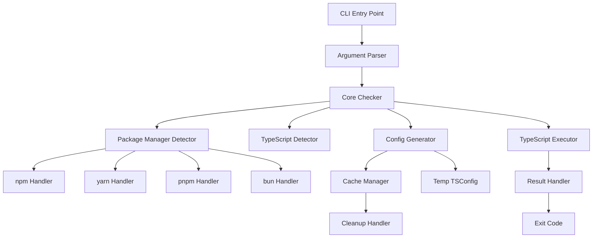
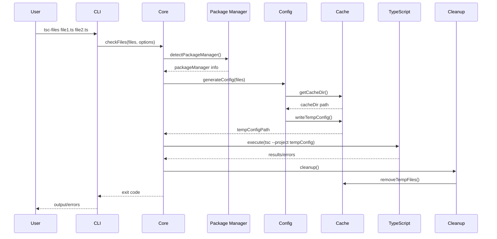

# Architecture Design: @jbabin91/tsc-files

## System Architecture



## Component Details

### 1. CLI Layer

**Responsibilities:**

- Parse command-line arguments
- Validate input files
- Handle help/version commands
- Forward to core checker

**Key Files:**

- `cli.ts` - Entry point, argument parsing
- `cli-parser.ts` - Parse and validate arguments

### 2. Core Checker

**Responsibilities:**

- Orchestrate the type checking process
- Coordinate between detectors and executors
- Handle errors and cleanup

**Key Files:**

- `core/checker.ts` - Main orchestration logic
- `core/runner.ts` - Execute TypeScript compiler

### 3. Detection Layer

#### Package Manager Detector

**Detection Strategy:**

```typescript
interface PackageManagerDetector {
  detect(): PackageManager | null;
  getLockFile(): string | null;
  getTscPath(): string | null;
  getNodeModulesPath(): string;
}
```

**Detection Priority:**

1. Check lock files (most reliable)
2. Check for package manager specific files
3. Check environment variables
4. Default to npm

#### TypeScript Detector

**Search Order:**

```typescript
async function detectTypeScript(): Promise<string> {
  // 1. Local installation
  const local = await findLocalTsc();
  if (local) return local;

  // 2. Package manager specific
  const pmSpecific = await findPackageManagerTsc();
  if (pmSpecific) return pmSpecific;

  // 3. Global installation
  const global = await findGlobalTsc();
  if (global) return global;

  // 4. Error - TypeScript not found
  throw new Error('TypeScript not found');
}
```

### 4. Configuration Layer

#### TSConfig Generation

**Strategy:**

```typescript
interface TempTSConfig {
  // Always extend the original
  extends: string;

  // One of these for file specification
  files?: string[];
  include?: string[];

  // Override options
  compilerOptions: {
    noEmit: true;
    [key: string]: any; // User options
  };
}
```

#### Cache Management

**Directory Structure:**

```sh
node_modules/.cache/@jbabin91/tsc-files/
├── configs/
│   ├── tsconfig-{hash}.json
│   └── tsconfig-{hash}.json
├── locks/
│   └── {pid}.lock
└── metadata.json
```

**Cleanup Strategy:**

- Always cleanup on success
- Cleanup on error via finally block
- Stale file detection (>1 hour old)
- Process lock files for concurrent usage

### 5. Execution Layer

#### Process Execution

**Key Features:**

- Stream output in real-time
- Capture exit codes properly
- Handle SIGINT gracefully
- Timeout protection

```typescript
interface ExecutionOptions {
  command: string;
  args: string[];
  cwd: string;
  timeout?: number;
  env?: NodeJS.ProcessEnv;
}
```

### 6. Error Handling

#### Error Categories

```typescript
enum ErrorType {
  // User errors (exit 1)
  TypeCheckFailed,
  NoFilesProvided,

  // Configuration errors (exit 2)
  TSConfigNotFound,
  InvalidTSConfig,

  // System errors (exit 3)
  TypeScriptNotFound,
  PackageManagerError,

  // Internal errors (exit 99)
  UnknownError,
  CacheError,
  CleanupError,
}
```

#### Error Recovery

```typescript
class ErrorHandler {
  handle(error: Error): never {
    // 1. Log detailed error for debugging
    if (verbose) console.error(error.stack);

    // 2. Show user-friendly message
    console.error(formatError(error));

    // 3. Cleanup temp files
    cleanup();

    // 4. Exit with appropriate code
    process.exit(getExitCode(error));
  }
}
```

## Data Flow

### Type Checking Flow



## Performance Considerations

### Optimization Strategies

1. **Early File Filtering**
   - Filter non-TS files immediately
   - Skip node_modules by default
   - Use glob patterns efficiently

2. **Cache Reuse**
   - Cache package manager detection
   - Reuse TypeScript binary path
   - Keep temp config for repeated runs

3. **Minimal I/O**
   - Single temp file write
   - Stream tsc output directly
   - Batch file operations

### Benchmarks Goals

| Scenario    | Target Time |
| ----------- | ----------- |
| Single file | <500ms      |
| 10 files    | <1s         |
| 100 files   | <3s         |
| 1000 files  | <10s        |

## Security Considerations

### Temp File Security

- Use cryptographically random names
- Set restrictive permissions (0600)
- Clean up on all exit paths
- Validate file paths

### Command Injection Prevention

```typescript
// Never use shell interpretation
// Always use array arguments
execFile('tsc', ['--project', configPath], options);

// Never do this:
exec(`tsc --project ${configPath}`); // VULNERABLE
```

## Extensibility Points

### Plugin System (Future)

```typescript
interface Plugin {
  name: string;
  beforeCheck?: (files: string[]) => string[];
  afterCheck?: (results: Results) => void;
  modifyConfig?: (config: TSConfig) => TSConfig;
}
```

### Custom Detectors

```typescript
interface Detector<T> {
  name: string;
  detect(): Promise<T | null>;
  priority: number;
}
```

## Testing Architecture

### Test Layers

1. **Unit Tests**
   - Individual functions
   - Mock file system
   - Mock process execution

2. **Integration Tests**
   - Real TypeScript projects
   - Actual file system
   - Real tsc execution

3. **E2E Tests**
   - Full CLI execution
   - Different project types
   - Error scenarios

### Test Infrastructure

```typescript
// Test utilities
class TestProject {
  constructor(
    private packageManager: PackageManager,
    private typescript: string,
  ) {}

  async setup(): Promise<void> {
    // Create temp project
    // Install dependencies
    // Create test files
  }

  async runTscFiles(args: string[]): Promise<Result> {
    // Execute our tool
    // Capture output
    // Return results
  }

  async cleanup(): Promise<void> {
    // Remove temp project
  }
}
```
