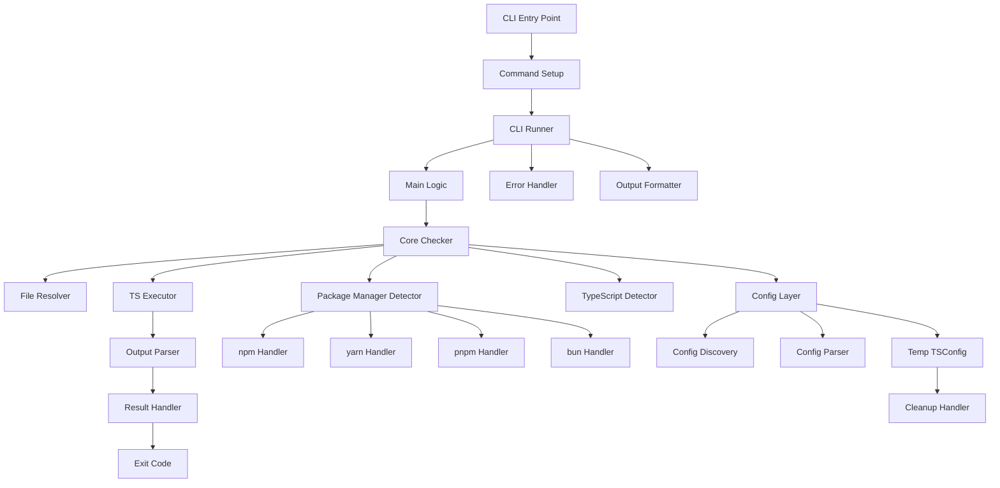
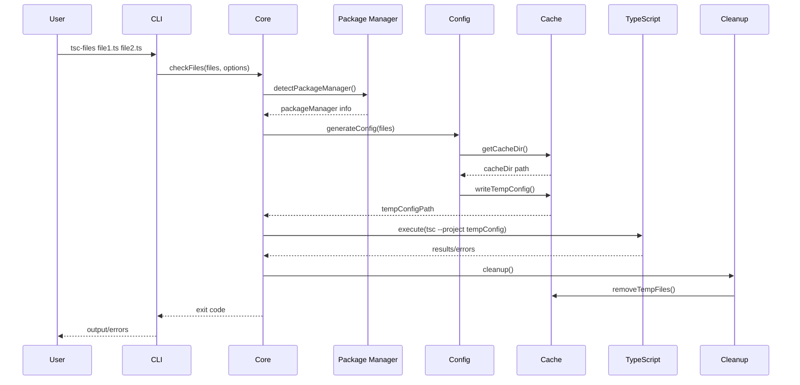

# Architecture Design: @jbabin91/tsc-files

## System Architecture



## Component Details

### 1. CLI Layer (Modular Architecture)

**Responsibilities:**

- Parse command-line arguments with **commander.js**
- Handle help/version commands with enhanced styling
- Provide colored output with **kleur**
- Show progress indicators with **ora**
- Categorize and format errors
- Environment variable support (`TSC_PROJECT`)
- Input validation and user-friendly error messages

**Key Files:**

- `src/cli/main.ts` - CLI entry point and program creation
- `src/cli/command.ts` - Commander.js program setup and validation
- `src/cli/runner.ts` - CLI execution logic and error handling
- `src/cli/errors.ts` - Error categorization and exit code management
- `src/cli/output.ts` - Output formatting and progress indication
- `src/types/cli.ts` - CLI-specific type definitions
- `src/types/core.ts` - Core TypeScript checker types

**Enhanced Features:**

```typescript
import { Command, Option, InvalidArgumentError } from 'commander';
import kleur from 'kleur';
import ora from 'ora';
import { logger } from '@/utils/logger';

// Environment variable support
.addOption(
  new Option('-p, --project <path>', 'path to tsconfig.json')
    .env('TSC_PROJECT')
    .argParser(validateProjectPath)
)

// Input validation
function validateProjectPath(value: string): string {
  if (!value.trim()) {
    throw new InvalidArgumentError('Project path cannot be empty.');
  }
  if (!value.endsWith('.json')) {
    throw new InvalidArgumentError(
      'Project path must point to a JSON file (e.g., tsconfig.json).'
    );
  }
  return value.trim();
}

// Colored output and enhanced help
program.configureHelp({
  styleTitle: kleur.bold,
  styleCommandText: kleur.cyan,
  styleCommandDescription: kleur.gray,
  styleOptionText: kleur.yellow,
  styleOptionDescription: kleur.gray,
});

// Verbose debugging with lifecycle hooks
.hook('preAction', (_, actionCommand) => {
  const options = actionCommand.opts();
  if (options.verbose) {
    logger.debug(`🔍 About to execute tsc-files with ${actionCommand.args.length} file argument(s)`);
    logger.debug(`📋 Options: ${JSON.stringify(options, null, 2)}`);
  }
})
```

### 2. Core Layer (Refactored Architecture)

**Responsibilities:**

- Orchestrate the type checking process
- Coordinate between detectors, resolvers, and executors
- Handle monorepo support with per-file tsconfig resolution
- Manage JavaScript file inclusion based on configuration
- Handle errors and cleanup

**Key Files:**

- `src/core/checker.ts` - Main orchestration logic (reduced from 680 to 279 lines)
- `src/core/file-resolver.ts` - File resolution with fast-glob optimizations
- `src/execution/executor.ts` - TypeScript compiler execution with enhanced error handling
- `src/execution/output-parser.ts` - Compiler output parsing and error extraction

**Enhanced Architecture:**

```typescript
// File resolution with performance optimizations
import fastGlob from 'fast-glob';

const files = await fastGlob(globPatterns, {
  cwd,
  absolute: true,
  onlyFiles: true,
  unique: true, // Prevent duplicate results
  baseNameMatch: true, // Efficient *.ts matching
  caseSensitiveMatch: false, // Cross-platform compatibility
  ignore: ['**/node_modules/**', '**/dist/**', '**/*.d.ts'],
});

// Enhanced TypeScript execution with execa
import { execa, type ExecaError } from 'execa';

const result = await execa(tsInfo.executable, args, {
  cwd,
  timeout: 30_000,
  cleanup: true,
  shell: tsInfo.useShell,
  all: true, // Capture combined stdout/stderr
  maxBuffer: 50 * 1024 * 1024, // 50MB buffer for large outputs
});
```

### 3. Detection Layer

#### Package Manager Detector

**Detection Strategy:**

```typescript
interface PackageManagerDetector {
  detect(): PackageManager | null;
  getLockFile(): string | null;
  getTscPath(): string | null;
  getNodeModulesPath(): string;
}
```

**Detection Priority:**

1. Check lock files (most reliable)
2. Check for package manager specific files
3. Check environment variables
4. Default to npm

#### TypeScript Detector

**Search Order:**

```typescript
async function detectTypeScript(): Promise<string> {
  // 1. Local installation
  const local = await findLocalTsc();
  if (local) return local;

  // 2. Package manager specific
  const pmSpecific = await findPackageManagerTsc();
  if (pmSpecific) return pmSpecific;

  // 3. Global installation
  const global = await findGlobalTsc();
  if (global) return global;

  // 4. Error - TypeScript not found
  throw new Error('TypeScript not found');
}
```

### 4. Configuration Layer

#### TSConfig Generation

**Strategy with Enhanced Dependencies:**

```typescript
import { cosmiconfigSync } from 'cosmiconfig';
import deepmerge from 'deepmerge';
import { loadConfig } from 'tsconfig-paths';
import { ensureDir, writeJSON } from 'fs-extra';

interface TempTSConfig {
  // Always extend the original
  extends: string;

  // One of these for file specification
  files?: string[];
  include?: string[];

  // Override options
  compilerOptions: {
    noEmit: true;
    [key: string]: any; // User options
  };
}

// Enhanced configuration resolution with cosmiconfig
const explorer = cosmiconfigSync('tsconfig', {
  searchPlaces: ['tsconfig.json', 'tsconfig.build.json'],
});

async function resolveConfig(configPath?: string): Promise<TSConfig> {
  const result = configPath ? explorer.load(configPath) : explorer.search();

  if (!result) throw new Error('TypeScript config not found');

  // Handle extends chain with deepmerge
  return resolveExtendsChain(result.config);
}

// Monorepo support: per-file tsconfig resolution (Issue #37)
function getTsConfigForFile(filePath: string): string {
  let currentDir = dirname(filePath);

  while (currentDir !== '/' && currentDir !== '.') {
    const tsconfigPath = join(currentDir, 'tsconfig.json');
    if (existsSync(tsconfigPath)) return tsconfigPath;
    currentDir = dirname(currentDir);
  }

  return 'tsconfig.json'; // fallback
}

// Path mapping resolution with tsconfig-paths
const { absoluteBaseUrl, paths } = loadConfig('.');
```

### 4. Configuration Layer (Modular Implementation)

**Key Files:**

- `src/config/discovery.ts` - tsconfig.json discovery in directories
- `src/config/parser.ts` - Configuration parsing and validation
- `src/config/temp-config.ts` - Temporary configuration generation

**Enhanced Features:**

```typescript
// Monorepo support with per-file tsconfig resolution
export async function findConfigForFile(
  filePath: string,
  baseConfig?: string,
): Promise<string> {
  const absolutePath = path.isAbsolute(filePath)
    ? filePath
    : path.resolve(filePath);
  let currentDir = path.dirname(absolutePath);

  while (currentDir !== path.parse(currentDir).root) {
    const tsconfigPath = path.join(currentDir, 'tsconfig.json');
    if (existsSync(tsconfigPath)) {
      return tsconfigPath;
    }
    currentDir = path.dirname(currentDir);
  }

  return baseConfig ?? 'tsconfig.json';
}

// JavaScript support based on allowJs/checkJs
export function shouldIncludeJavaScriptFiles(tsconfigPath?: string): boolean {
  if (!tsconfigPath || !existsSync(tsconfigPath)) {
    return false;
  }

  try {
    const config = JSON.parse(readFileSync(tsconfigPath, 'utf8'));
    const compilerOptions = config.compilerOptions || {};
    return Boolean(compilerOptions.allowJs || compilerOptions.checkJs);
  } catch {
    return false;
  }
}
```

#### Cache Management (Simplified)

**Strategy:**

- Use system temp directory with cryptographically secure names
- Automatic cleanup on exit (success or failure)
- No persistent cache (simplicity over complexity)
- Platform-specific temp handling (Windows/Unix)

```typescript
// Secure temp file creation
const tempConfigPath = path.join(os.tmpdir(), `tsconfig.${uuid()}.json`);

// Always cleanup
try {
  const result = await executeTypeScript(tempConfigPath, files, cwd, options);
  return result;
} finally {
  await cleanupTempConfig(tempConfigPath);
}
```

### 5. Execution Layer (Enhanced with execa)

**Key Files:**

- `src/execution/executor.ts` - TypeScript compiler execution
- `src/execution/output-parser.ts` - Compiler output parsing

**Enhanced Process Execution:**

```typescript
export type ExecutionResult = {
  success: boolean;
  stdout: string;
  stderr: string;
  allOutput: string; // Combined stdout/stderr
  exitCode: number;
  errorMessage?: string;
};

// Enhanced execution with proper error handling
export async function executeTypeScriptCompiler(
  tempConfigPath: string,
  cwd: string,
  options: Pick<CheckOptions, 'verbose'>,
): Promise<ExecutionResult> {
  const tsInfo = findTypeScriptCompiler(cwd);
  const args = [...tsInfo.args, '--project', tempConfigPath];

  try {
    const result = await execa(tsInfo.executable, args, {
      cwd,
      timeout: 30_000,
      cleanup: true,
      shell: tsInfo.useShell,
      all: true, // Capture combined stdout/stderr
      maxBuffer: 50 * 1024 * 1024, // 50MB buffer
    });

    return {
      success: true,
      stdout: result.stdout,
      stderr: result.stderr,
      allOutput: result.all || `${result.stdout}\n${result.stderr}`.trim(),
      exitCode: result.exitCode ?? 0,
    };
  } catch (execError: unknown) {
    // Enhanced error handling for ExecaError
    if (execError && typeof execError === 'object' && 'exitCode' in execError) {
      const { stdout, stderr, allOutput, exitCode, message } =
        extractExecutionDetails(execError as ExecaError);

      return {
        success: false,
        stdout,
        stderr,
        allOutput,
        exitCode,
        errorMessage: message,
      };
    }

    // Fallback error handling
    return {
      success: false,
      stdout: '',
      stderr: '',
      allOutput: '',
      exitCode: 1,
      errorMessage: String(execError),
    };
  }
}
```

**Key Features:**

- Proper ExecaError handling with type safety
- 50MB buffer for large TypeScript outputs
- Combined stdout/stderr capture
- Cross-platform execution with shell mode detection
- Timeout protection (30 seconds)
- Comprehensive error extraction

### 6. Error Handling (Enhanced Architecture)

**Key Files:**

- `src/cli/errors.ts` - Error categorization and exit code management
- `src/utils/error-formatter.ts` - Error message formatting utilities
- `src/utils/logger.ts` - Centralized logging system

#### Error Categories (Implemented)

```typescript
// Exit code determination based on error analysis
export function determineExitCode(result: CheckResult): number {
  // Check for configuration errors first (exit 2)
  const configError = result.errors.find(
    (error) =>
      error.code === 'CONFIG_ERROR' ||
      error.message.includes('tsconfig.json') ||
      error.message.includes('TypeScript config not found'),
  );

  if (configError) return 2;

  // Type errors (exit 1)
  if (result.errorCount > 0) return 1;

  // Success (exit 0)
  return 0;
}

// Enhanced error formatting with colors
export function formatConfigurationError(
  result: CheckResult,
): ConfigErrorInfo | null {
  const configError = result.errors.find(/* ... */);

  if (!configError) return null;

  return {
    message: `${kleur.red('Configuration Error:')} ${kleur.dim(configError.message)}`,
    tip: `${kleur.yellow('Tip:')} Use --project flag to specify a different tsconfig.json path`,
  };
}
```

#### Centralized Logging

```typescript
// Configurable logger with silent mode support
export interface Logger {
  info(message: string): void;
  warn(message: string): void;
  error(message: string): void;
  debug(message: string): void;
}

// Default implementation with console
let currentLogger: Logger = {
  info: console.log,
  warn: console.warn,
  error: console.error,
  debug: console.debug,
};

// Allow custom logger injection for testing
export function setLogger(newLogger: Logger): void {
  currentLogger = newLogger;
}
```

#### Error Recovery Strategy

- **Graceful degradation**: Continue processing other files when possible
- **Detailed error context**: File, line, column information
- **User-friendly messages**: Clear error descriptions with helpful tips
- **Proper cleanup**: Always cleanup temp files regardless of error
- **Exit code compliance**: Standard exit codes for different error types

## Data Flow

### Type Checking Flow



## Performance Considerations

### Optimization Strategies

1. **Early File Filtering**
   - Filter non-TS files immediately
   - Skip node_modules by default
   - Use glob patterns efficiently

2. **Cache Reuse**
   - Cache package manager detection
   - Reuse TypeScript binary path
   - Keep temp config for repeated runs

3. **Minimal I/O**
   - Single temp file write
   - Stream tsc output directly
   - Batch file operations

### Performance Targets & Optimizations

| Scenario    | Target Time |
| ----------- | ----------- |
| Single file | <500ms      |
| 10 files    | <1s         |
| 100 files   | <3s         |
| 1000 files  | <10s        |

**Performance Optimizations Implemented:**

- **Fast-glob optimizations**: `unique`, `baseNameMatch`, `caseSensitiveMatch`
- **Enhanced execa execution**: 50MB buffer, proper shell detection
- **Efficient file resolution**: Early filtering, glob pattern optimization
- **Minimal I/O operations**: Single temp file write, streaming output
- **Package manager caching**: Cached detection across runs

**Note**: Actual performance varies based on project complexity, TypeScript configuration, system resources, and file sizes. The targets above represent goals for typical use cases.

## Security Considerations

### Temp File Security

- Use cryptographically random names
- Set restrictive permissions (0600)
- Clean up on all exit paths
- Validate file paths

### Command Injection Prevention

```typescript
// Never use shell interpretation
// Always use array arguments
execFile('tsc', ['--project', configPath], options);

// Never do this:
exec(`tsc --project ${configPath}`); // VULNERABLE
```

## Extensibility Points

### Plugin System (Future)

```typescript
interface Plugin {
  name: string;
  beforeCheck?: (files: string[]) => string[];
  afterCheck?: (results: Results) => void;
  modifyConfig?: (config: TSConfig) => TSConfig;
}
```

### Custom Detectors

```typescript
interface Detector<T> {
  name: string;
  detect(): Promise<T | null>;
  priority: number;
}
```

## Testing Architecture (Comprehensive Implementation)

### Current Test Coverage

- **531 passing tests** across 27 test files
- **84%+ core coverage** with strict thresholds
- **Vitest framework** with comprehensive mocking
- **Cross-platform testing** via GitHub Actions

### Test Layers (Implemented)

1. **Unit Tests** (494 tests)
   - Individual function testing with proper mocking
   - File system operations with memfs
   - Process execution with vitest mocks
   - Type-safe mocking without `any` types

2. **Integration Tests** (24 tests)
   - Real TypeScript projects
   - Actual file system operations
   - Cross-platform compatibility testing
   - Package manager integration

3. **End-to-End Tests** (GitHub Actions)
   - Full CLI execution across platforms
   - Real package installation and usage
   - Performance benchmarking
   - Error scenario validation

### Test Infrastructure (Production)

```typescript
// Enhanced test setup with proper TypeScript support
import { beforeEach, afterEach, vi } from 'vitest';
import type { Result } from 'execa';

// Helper for type-safe execa mocking
const createMockExecaResult = (
  overrides: {
    stdout?: string;
    stderr?: string;
    exitCode?: number;
    all?: string;
  } = {},
): Result => {
  const stdout = overrides.stdout ?? '';
  const stderr = overrides.stderr ?? '';
  return {
    stdout,
    stderr,
    exitCode: overrides.exitCode ?? 0,
    all: overrides.all ?? `${stdout}\n${stderr}`.trim(),
  } as Result;
};

// Comprehensive module mocking
vi.mock('execa');
vi.mock('@/detectors/typescript', () => ({
  findTypeScriptCompiler: vi.fn(() => ({
    executable: 'tsc',
    args: ['--noEmit'],
    packageManager: { manager: 'npm' },
    useShell: false,
  })),
}));

// Coverage thresholds per module
export default defineConfig({
  test: {
    coverage: {
      thresholds: {
        'src/cli/**': {
          statements: 89,
          branches: 85,
          functions: 89,
          lines: 89,
        },
        'src/core/**': {
          statements: 85,
          branches: 80,
          functions: 85,
          lines: 85,
        },
        'src/utils/**': {
          statements: 90,
          branches: 85,
          functions: 90,
          lines: 90,
        },
      },
    },
  },
});
```

### Integration Test Strategy

```typescript
// Cross-platform integration testing via GitHub Actions
- name: Run Integration Tests
  uses: ./.github/actions/integration-tests
// Tests include:
// - Package installation via npm pack
// - CLI execution across Windows/macOS/Linux
// - Performance benchmarking
// - Error scenario validation
// - Package manager compatibility (npm/yarn/pnpm/bun)
```
