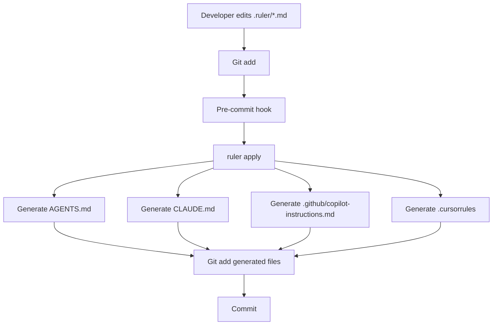

# Design: Ruler Integration for Multi-Agent AI Instructions

## Context

### Current State

The project currently manages AI agent instructions through multiple files:

1. **AGENTS.md** (910 lines) - Universal project standards + Claude-specific content
2. **CLAUDE.md** (910 lines) - Exact copy of AGENTS.md, synced via lefthook
3. **.github/copilot-instructions.md** (218 lines) - Manually maintained Copilot-specific instructions
4. **.claude/commit-conventions.md** (~100-150 lines) - Universal content wrongly placed in Claude-specific directory
5. **.claude/github-workflow.md** (~430 lines) - Universal content wrongly placed in Claude-specific directory

**Analysis reveals 82-85% content overlap:**

- ~1,630-2,130 lines of universal content applicable to ALL agents
- Only ~250-300 lines are Claude-specific (Plan Mode, sub-agents, TodoWrite)
- Massive duplication with manual synchronization

**Problems:**

- File duplication (AGENTS.md ↔ CLAUDE.md = 910 lines duplicated)
- Mixed concerns (universal standards + Claude-specific workflows in AGENTS.md)
- Misplaced universal content (git conventions, GitHub workflow in `.claude/`)
- No support for additional AI agents (Cursor, OpenCode)
- Fragile lefthook sync script
- Manual maintenance overhead scaling poorly to 4+ agents
- 82-85% overlap makes manual sync unsustainable

### Constraints

1. **Claude Code** specifically looks for `CLAUDE.md` (cannot be renamed)
2. **GitHub Copilot** looks for `.github/copilot-instructions.md`
3. **Other agents** (Cursor, Aider) have their own conventional file names
4. Must maintain backward compatibility during migration
5. Zero-tolerance quality policy - all changes must pass quality gates
6. Cross-platform support (Windows/macOS/Linux)

### Stakeholders

- **Development team** - Primary users of AI coding assistants
- **Contributors** - Need clear instructions on how to update AI agent rules
- **CI/CD pipeline** - Must validate generated files

## Goals / Non-Goals

### Goals

1. **Centralize AI agent instruction management** in a single source of truth (.ruler/ directory)
2. **Support 4 actively-used AI agents** (Claude Code, GitHub Copilot, Cursor, OpenCode)
3. **Separate universal standards (82-85%) from tool-specific workflows (15-18%)**
4. **Enable selective inclusion** per agent (PR reviews: ~800 lines, dev agents: ~1,600-2,400 lines)
5. **Automate file generation** via pre-commit hooks (ruler apply)
6. **Use industry-standard tooling** (Ruler + AGENTS.md 2025 standard)
7. **Maintain backward compatibility** for Claude Code and Copilot
8. **Align with industry standards** (AGENTS.md backed by OpenAI, Google, Cursor - 20,000+ repos)

### Non-Goals

- Building custom AI instruction management tool (use Ruler instead)
- Supporting agents not supported by Ruler
- Changing existing instruction content (only reorganization)
- Real-time sync of generated files (pre-commit is sufficient)

## Decisions

### Decision 1: Use Ruler vs Alternatives

**Options considered:**

**A. Simple Concatenation Script**

```bash
cat .ruler/*.md > AGENTS.md
```

- Pros: Simple, no dependencies
- Cons: No selective inclusion (can't create curated 800-line copilot-instructions.md vs 1,600-line AGENTS.md)
- Cons: No per-agent customization
- Cons: Must implement ordering, header injection, metadata ourselves
- **Verdict:** Insufficient for multi-agent with different content needs

**B. Symlinks**

```bash
ln -s AGENTS.md CLAUDE.md
```

- Pros: Zero duplication
- Cons: **BLOCKER** - changesets/action breaks with symlinks (GitHub API commit signing)
- Cons: Can't have different content per agent (Copilot needs curated subset, Claude needs extra)
- **Verdict:** Not viable due to changesets constraint + selective inclusion requirement

**C. Keep current lefthook sync**

- Pros: Simple, already implemented
- Cons: Only works for 2 agents (AGENTS.md → CLAUDE.md)
- Cons: 82-85% duplication wasteful
- Cons: Doesn't scale to 4+ agents
- **Verdict:** Unsustainable with current and planned agent adoption

**D. Build custom multi-agent sync script**

- Pros: Full control, tailored to our needs
- Cons: Maintenance burden, reinventing wheel, testing overhead
- Cons: Must implement selective inclusion logic ourselves
- **Verdict:** Reinventing what Ruler already provides

**E. Adopt Ruler** ✅ **CHOSEN**

- Pros: Industry standard (1.5k+ stars), actively maintained, battle-tested
- Pros: Selective inclusion per agent (copilot: ~800 lines, AGENTS.md: ~1,600 lines)
- Pros: Supports 25+ agent formats out-of-box (future-proof)
- Pros: Handles ordering, headers, metadata automatically
- Pros: Single source of truth with 82-85% content reuse
- Cons: External dependency (mitigated by active maintenance and popularity)
- **Rationale:** Ruler solves exactly this problem with selective inclusion + multi-agent support

### Decision 2: File Organization Strategy

**Options considered:**

**A. Single `.ruler/instructions.md` file**

- Pros: Simple, single source
- Cons: 1,900+ lines total, mixed concerns, hard to maintain
- Cons: No separation between universal (82-85%) and tool-specific (15-18%)
- **Verdict:** Too monolithic for 4+ agents

**B. Modular `.ruler/*.md` files by topic** ✅ **CHOSEN**

- Pros: Separation of concerns, easier maintenance, clear ownership
- Pros: Universal content (82-85%) cleanly separated from tool-specific (15-18%)
- Pros: Each file has single responsibility (~100-700 lines)
- Cons: More files to manage (8 vs 1)
- **Rationale:** With 82-85% overlap, modular organization essential for maintainability

**Final Structure (8 files):**

```text
.ruler/
├── instructions.md              # Universal standards (~600-700 lines)
├── git-conventions.md           # Commits + branches (~150-200 lines) [MOVED + EXPANDED]
├── github-workflow.md           # MCP vs gh CLI (~430 lines) [MOVED]
├── security.md                 # Security requirements (~100-150 lines)
├── testing.md                  # Testing guidelines (~100-150 lines)
├── agentic-workflows.md        # Universal patterns (~200-300 lines) [NEW]
├── permissions.md              # Permission gates (~150-200 lines) [NEW]
├── claude-workflows.md         # Claude-specific (~250-300 lines)
└── ruler.toml                  # Configuration

Total: ~1,880-2,430 lines (82-85% universal, 15-18% Claude-specific)
```

### Decision 3: Generated File Management

**Options considered:**

**A. Commit all generated files to git** ✅ **CHOSEN**

- Pros: Simple workflow - no regeneration needed locally
- Pros: Files always available for agents immediately after pull
- Pros: Clear git history showing what changed in both source and generated files
- Pros: Pre-commit hook keeps everything in sync automatically
- Pros: Deterministic generation means minimal git churn
- Cons: Generated files in git history (mitigated: files are deterministic, well-organized)
- **Rationale:** Simplest approach with best developer experience. Generated files are essential for functionality and deterministically generated from source.

**B. Git-ignore all generated files**

- Pros: Clean git history, clear source of truth
- Cons: Requires local regeneration by all developers
- Cons: AGENTS.md is documentation standard (like README.md), should be discoverable
- **Verdict:** AGENTS.md needs to be visible in repo for discovery

**C. Hybrid: Commit AGENTS.md, git-ignore others**

- Pros: AGENTS.md committed as documentation
- Pros: Tool-specific files kept out of git
- Cons: More complex workflow (developers must regenerate locally)
- Cons: Adds .gitignore complexity
- **Verdict:** Unnecessarily complex when simple commit-all approach works better

### Decision 4: Tool-Specific Content Distribution

**Selective inclusion strategy:**

- **AGENTS.md**: Universal content only (~1,630-2,130 lines)
- **CLAUDE.md**: Universal + Claude-specific (~1,880-2,430 lines)
- **.github/copilot-instructions.md**: Curated for PR reviews (~800-1,000 lines)
- **.cursorrules**: Universal except github-workflow.md (~1,200-1,630 lines)

**Ruler configuration (ruler.toml):**

```toml
# .ruler/ruler.toml

# AGENTS.md - Industry standard for Cursor, OpenCode, Copilot Coding Agent
[agents.agents]
output_path = "AGENTS.md"
include = [
  "instructions.md",           # ~600-700 lines
  "git-conventions.md",        # ~150-200 lines
  "github-workflow.md",        # ~430 lines
  "security.md",              # ~100-150 lines
  "testing.md",               # ~100-150 lines
  "agentic-workflows.md",     # ~200-300 lines
  "permissions.md"            # ~150-200 lines
]
# Total: ~1,630-2,130 lines (committed)

# CLAUDE.md - Claude Code specific
[agents.claude]
output_path = "CLAUDE.md"
include = [
  "instructions.md",
  "git-conventions.md",
  "github-workflow.md",
  "security.md",
  "testing.md",
  "agentic-workflows.md",
  "permissions.md",
  "claude-workflows.md"       # ~250-300 lines (CLAUDE-SPECIFIC)
]
# Total: ~1,880-2,430 lines (committed)

# .github/copilot-instructions.md - Copilot PR Code Review
[agents.github_copilot]
output_path = ".github/copilot-instructions.md"
include = [
  "instructions.md",          # Focus on core project context
  "git-conventions.md",       # PR review needs commit/branch standards
  "security.md"              # PR review needs security awareness
  # Excludes: github-workflow.md, testing.md, agentic-workflows.md, permissions.md
  # Rationale: Curated subset for PR review scope, not full development
]
# Total: ~800-1,000 lines (committed)

# .cursorrules - Cursor legacy format support
[agents.cursor]
output_path = ".cursorrules"
include = [
  "instructions.md",
  "git-conventions.md",
  "security.md",
  "testing.md",
  "agentic-workflows.md",
  "permissions.md"
  # Excludes: github-workflow.md (unclear MCP support in legacy format)
  # Excludes: claude-workflows.md (Claude-specific)
]
# Total: ~1,200-1,630 lines (committed)
```

### Decision 5: Pre-commit Hook Integration

**Replace lefthook sync-docs with ruler apply:**

```yaml
# lefthook.yml
pre-commit:
  commands:
    ruler-apply:
      glob: '.ruler/**/*.md'
      run: npx ruler apply
      priority: 1
```

**Rationale:**

- Trigger on any `.ruler/**/*.md` change
- Generate all 4 files via `ruler apply`
- Developer manually stages all changed files (both .ruler/ source and generated outputs)
- Priority 1 ensures generation happens before other hooks

### Decision 6: Token Optimization Strategy

**Chosen Approach:** Apply systematic optimizations to reduce context weight while improving functionality.

**Key Optimizations:**

1. **Command Batching** - Consolidate quality gate commands:

```bash
# Before: 6 separate commands (6 tool calls)
pnpm lint
pnpm format
pnpm typecheck
pnpm test:coverage
pnpm lint:md
pnpm build

# After: 1 batched command (1 tool call)
pnpm lint && pnpm format && pnpm typecheck && pnpm test:coverage && pnpm lint:md && pnpm build
```

2. **Content Deduplication** - Single source of truth for commands, examples, architecture diagrams
   - Eliminate 3-4 duplicate command listings
   - Collapse similar code blocks into comprehensive examples
   - Reference detailed architecture docs instead of repeating diagrams

3. **Sub-Agent Pattern Documentation** - Add orchestrator-worker pattern to `agentic-workflows.md`
   - Claude Code: Task tool (already documented)
   - Cursor: Agent mode with auto-context
   - Amp (Sourcegraph): Native subagent spawning (new discovery, July 2025)

4. **Architecture References** - Link to `@docs/architecture/README.md` instead of duplicating
   - Keep only quick reference layer diagram
   - Save ~30-40 lines per instruction file

**Impact Analysis:**

| Metric              | Before | After     | Savings        |
| ------------------- | ------ | --------- | -------------- |
| Total lines         | 2,487  | 2,390-415 | ~70-95 (~3-4%) |
| Quality gate calls  | 6      | 1         | 5 calls        |
| Command duplicates  | 3-4    | 1         | Eliminated     |
| Architecture copies | 2-3    | 1         | Eliminated     |

**Rationale:**

- Command batching provides high-impact reduction in tool call overhead (5+ calls per quality check)
- Content deduplication reduces maintenance burden and context weight
- Sub-agent documentation enables parallelization for 3 of 4 supported tools
- Optimizations applied during content migration (Section 2.10 in tasks.md)

**Trade-offs:**

- Slightly longer single command vs separate commands (acceptable: fail-fast behavior maintained)
- References require documentation to be comprehensive (already true)
- Sub-agent patterns may not apply to all future tools (mitigated: clearly documented per-tool support)

**Future Considerations:**

- Monitor Amp (Sourcegraph) adoption for potential 5th agent support
- Research Windsurf (Codeium) instruction file format
- Continue evaluating command batching effectiveness in CI/CD

## Architecture Design

### Directory Structure

```sh
tsc-files/
├── .ruler/                          # Source of truth (8 files)
│   ├── instructions.md              # Universal standards (~600-700 lines)
│   ├── git-conventions.md           # Commits + branches (~150-200 lines) [MOVED + EXPANDED]
│   ├── github-workflow.md           # MCP vs gh CLI (~430 lines) [MOVED]
│   ├── security.md                 # Security requirements (~100-150 lines)
│   ├── testing.md                  # Testing guidelines (~100-150 lines)
│   ├── agentic-workflows.md        # Universal patterns (~200-300 lines) [NEW]
│   ├── permissions.md              # Permission gates (~150-200 lines) [NEW]
│   ├── claude-workflows.md         # Claude-specific (~250-300 lines)
│   └── ruler.toml                  # Configuration
│
├── AGENTS.md                        # Generated: ~1,630-2,130 lines (committed)
├── CLAUDE.md                        # Generated: ~1,880-2,430 lines (committed)
├── .github/
│   └── copilot-instructions.md      # Generated: ~800-1,000 lines (committed)
└── .cursorrules                     # Generated: ~1,200-1,630 lines (committed)
```

### Content Distribution Matrix

| Generated File                 | instructions | git-conv | github-wf | security | testing | agentic-wf | permissions | claude-wf |
| ------------------------------ | ------------ | -------- | --------- | -------- | ------- | ---------- | ----------- | --------- |
| AGENTS.md (~1,630-2,130)       | ✅           | ✅       | ✅        | ✅       | ✅      | ✅         | ✅          | ❌        |
| CLAUDE.md (~1,880-2,430)       | ✅           | ✅       | ✅        | ✅       | ✅      | ✅         | ✅          | ✅        |
| copilot-instructions (~800-1k) | ✅           | ✅       | ❌        | ✅       | ❌      | ❌         | ❌          | ❌        |
| .cursorrules (~1,200-1,630)    | ✅           | ✅       | ❌        | ✅       | ✅      | ✅         | ✅          | ❌        |

**Legend:** git-conv = git-conventions.md, github-wf = github-workflow.md, agentic-wf = agentic-workflows.md, claude-wf = claude-workflows.md

### Workflow



## Migration Plan

### Phase 1: Setup (1-2 hours)

1. **Install Ruler**

   ```bash
   pnpm add --save-dev @intellectronica/ruler
   ```

2. **Initialize Ruler**

   ```bash
   npx ruler init
   ```

3. **Configure ruler.toml**
   - Define agents (claude, github_copilot, cursor, agents)
   - Set output paths
   - Configure include patterns

### Phase 2: Content Migration (2-3 hours)

1. **Extract universal standards from AGENTS.md** → `.ruler/instructions.md`
   - TypeScript guidelines
   - Code comments policy
   - File organization
   - Error handling
   - Commit conventions
   - Development commands

2. **Extract Claude-specific content from CLAUDE.md** → `.ruler/claude-workflows.md`
   - Plan Mode usage patterns
   - Sub-agent delegation
   - TodoWrite guidelines
   - ClaudeLog best practices
   - Context management

3. **Extract security content** → `.ruler/security.md`
   - Temp file security
   - Command execution protocols
   - Input validation

4. **Extract testing content** → `.ruler/testing.md`
   - Testing strategy
   - Coverage requirements
   - Test patterns

5. **Create agentic-workflows.md** → `.ruler/agentic-workflows.md`
   - Extract universal workflow patterns from claude-workflows.md
   - Task complexity assessment patterns
   - Tool selection decision trees (Glob/Grep/Read/Task)
   - Parallel vs sequential execution guidelines
   - Error recovery patterns
   - Context management strategies

6. **Create permissions.md** → `.ruler/permissions.md`
   - Git commit permission gate (ask before committing, even if files staged)
   - Git push permission gate (ask before pushing to remote)
   - Respect for partial staging (staged vs unstaged files)
   - Three-gate system (Fix → Stage → STOP → Commit → STOP → Push)
   - Common instruction patterns ("fix this" = stage only, "commit this" = actually commit)
   - Changesets creation requirements
   - pnpm-lock.yaml modification rules
   - Publishing/release permissions

7. **Create git-conventions.md** → `.ruler/git-conventions.md`
   - Copy `.claude/commit-conventions.md` content
   - Add Conventional Branch 1.0.0 specification
   - Add branch naming format: `<type>/<description>`
   - Add branch naming rules and examples
   - Remove original `.claude/commit-conventions.md`

8. **Move github-workflow.md** → `.ruler/github-workflow.md`
   - Move from `.claude/github-workflow.md` to `.ruler/`
   - Verify MCP vs gh CLI decision tree is complete
   - Verify PR operations and code review workflows documented
   - Remove original `.claude/github-workflow.md`

### Phase 3: Integration (1-2 hours)

1. **Update lefthook.yml**
   - Remove old sync-docs hook
   - Add ruler-apply hook

2. **Update .gitignore**

   ```gitignore
   # Generated by Ruler (AGENTS.md is committed as documentation)
   /CLAUDE.md
   /.cursorrules
   /.github/copilot-instructions.md
   ```

3. **Test generation**

   ```bash
   npx ruler apply
   git diff  # Verify generated files match expectations
   ```

### Phase 4: Documentation (1 hour)

1. **Update README.md** - Reference new workflow
2. **Update CONTRIBUTING.md** - How to update AI agent instructions
3. **Create .ruler/README.md** - Explain file organization

### Phase 5: Rollback Plan

If issues arise:

1. Restore original AGENTS.md, CLAUDE.md from git
2. Remove `.ruler/` directory
3. Restore lefthook sync-docs hook
4. Remove ruler from package.json

## Risks / Trade-offs

### Risk 1: Ruler External Dependency

**Risk:** Ruler project could be abandoned or break in future updates

**Mitigation:**

- Ruler is actively maintained (latest commit: recent)
- Pin Ruler version in package.json
- Fallback: Generated files can be committed to git if Ruler breaks
- Ultimate fallback: Revert to lefthook sync

### Risk 2: Team Adoption

**Risk:** Team unfamiliar with Ruler workflow, may edit generated files directly

**Mitigation:**

- Clear documentation in CONTRIBUTING.md
- Pre-commit hook shows warning if generated files edited directly
- PR review checklist includes "Updates made to .ruler/ not generated files"

### Risk 3: Merge Conflicts

**Risk:** Merge conflicts in generated files during parallel PR work

**Mitigation:**

- Commit all generated files (AGENTS.md, CLAUDE.md, .cursorrules, .github/copilot-instructions.md)
- Deterministic generation means minimal git churn
- Pre-commit hook ensures files stay in sync with .ruler/ sources
- CI/CD validates generation: `ruler apply && git diff --exit-code`

### Risk 4: CI/CD Integration

**Risk:** CI builds fail if generated files not up-to-date

**Mitigation:**

- Add CI check: `npx ruler apply && git diff --exit-code`
- Pre-commit hook ensures all files stay in sync with .ruler/ sources
- Fails build if any generated file is out of date

## Open Questions

1. **Should generated files be committed to git?**
   - **Decision:** Yes, commit all generated files (AGENTS.md, CLAUDE.md, .cursorrules, .github/copilot-instructions.md)
   - **Rationale:** Simplest workflow with best developer experience. Files are deterministically generated, essential for functionality, and pulled developers get working configs immediately.

2. **How to handle .github/copilot-instructions.md existing customizations?**
   - **Action:** Review current file, extract any unique content to `.ruler/` before migration

3. **Should we add AI agent detection/discovery?**
   - **Proposed:** Document in README which agents are supported
   - **Future:** Could add `ruler list-agents` to show available configs

4. **What about OpenSpec AGENTS.md?**
   - **Clarification:** `openspec/AGENTS.md` is separate, contains OpenSpec workflow instructions
   - **Action:** No changes needed, it's domain-specific

## Success Metrics

1. **Functionality:** All existing AI agent instructions preserved and working
2. **Scalability:** Support for 4+ AI agents (Claude, Copilot, Cursor, OpenCode)
3. **Maintainability:** Instruction updates take < 5 minutes
4. **Quality:** Zero build failures due to Ruler integration
5. **Adoption:** 100% of team trained and using Ruler workflow
